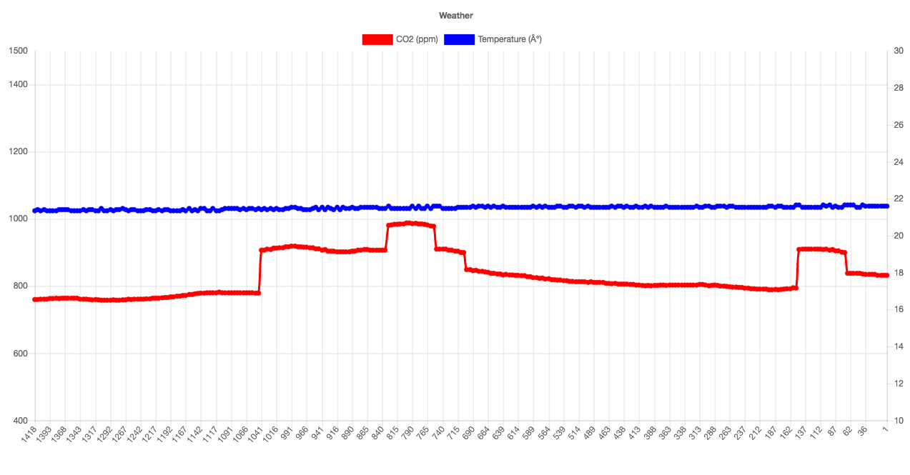

# Mad CO2



A simple http server connecting to a CO2 Monitor device

## Installation / Building

( Currently only builds on Mac OSX, should be easily portable to linux )

```bash
brew install boost
brew install cpprestsdk
brew install openssl

git clone https://github.com/Maddimax/MadCO2.git
cd MadCO2
git submodule update --init

mkdir build
cd build
cmake ../
make
```

## Usage

* Terminal

```bash
./madco2
```

* Open http://127.0.0.1:35842

## Credits

* Based heavily on [this hackaday project](https://hackaday.io/project/5301-reverse-engineering-a-low-cost-usb-co-monitor)
* Includes [this Chart javascript library](https://github.com/chartjs/Chart.js/releases/download/v2.7.3/Chart.bundle.min.js)
* Uses [this HID Api](https://github.com/signal11/hidapi)
* Uses Microsofts [cpprestsdk](https://github.com/Microsoft/cpprestsdk)
* Works with [this CO2 Monitor device](https://www.co2meter.com/products/co2mini-co2-indoor-air-quality-monitor) (~70$ on amazon)
